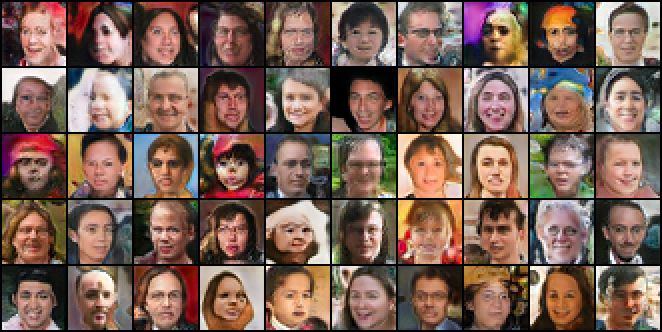

## StyleGAN

**Train StyleGAN**

First, prepare the dataset for training. Download the FFHQ dataset from (https://github.com/NVlabs/ffhq-dataset) and save it to DATASET_PATH.
LMDB_PATH: directory to save the output dataset, N_WORKER: number of workers, DATASET_PATH: the downloaed FFHQ images folder path 
```bash
python prepare_data.py --out LMDB_PATH --n_worker N_WORKER DATASET_PATH
```

Second, train the StyleGAN for FFHQ dataset.
```bash
python train.py --mixing LMDB_PATH
```

*Notes for training*
1) The original tensorflow implementation can't be 100% converted by MXNet. Two functions are missing, gradient penalty and blur. The lack of gradient penalty can cause mode collapse while training, so it is neccessary to tune the learning rate based on the number of GPUs and apply early stop. The lack of blur function results in the low image quality and this is one of the important reasons that high-resolution images can't be generted via our implementation. 
2) This is an unstable version of StyleGAN. We've tested the training by using 8 GPUs and single GPU. Single GPU can be problematic. The following images are generated by a model trained with 8 GPUs. 
3) It takes around 4 days with 8 GPUs to train a StyleGAN to generate 128x128 images.  



**Test StyleGAN**

Test the converted pretrained weights on [Flickr-Faces-HQ Dataset (FFHQ)](https://github.com/NVlabs/ffhq-dataset). The converted pretrained model "stylegan-ffhq-1024px-new.params" can be downloaded from [Google Drive](https://drive.google.com/file/d/1dYWAT9L3r2jmGe741AiSSAxg1su3ODvj/view?usp=sharing).

```bash
python demo_stylegan.py --path ./stylegan-ffhq-1024px-new.params --gpu_id -1
```

**Generated images from the converted pretrained FFHQ weight**


## References
[A Style-Based Generator Architecture for Generative Adversarial Networks, CVPR 2019](https://arxiv.org/abs/1812.04948)